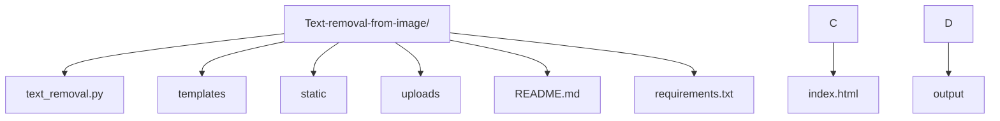

# 🧼 Text Removal from Image using EasyOCR and OpenCV


This project is a **Flask-based web application** that detects and removes text from images using **EasyOCR** and **OpenCV inpainting techniques**, preserving the background and visual quality.

---

## 🚀 Features

- 🔍 Text Detection using EasyOCR
- 🧽 Text Removal via OpenCV Inpainting
- 🌐 Web interface using Flask with a modern UI
- 📸 Supports JPG, PNG, and JPEG files
- 📥 Download cleaned image after processing

---

## 📂 Project Structure

## 🛠️ Installation & Usage

### 1️⃣ Clone the Repo

```bash
git clone https://github.com/AyinalaVinayKumar/Text-removal-from-image.git
cd Text-removal-from-image
```

### Create Virtual Environment (Optional but Recommended)

```bash
python -m venv venv
source venv/bin/activate  # or venv\\Scripts\\activate (Windows)
```
### 3️⃣ Install Requirements
```bash

pip install -r requirements.txt
```
### 4️⃣ Run the Flask App
```
```bash

python app.py
```

🧪 Sample Images
Place your test images in the uploads/ folder or use the web interface to upload manually.

🧰 Tech Stack
🐍 Python 3.8+

🔥 Flask

👁️ EasyOCR

🎨 OpenCV

💅 HTML + CSS (Glassmorphism UI)

📦 Dependencies

flask
opencv-python
easyocr
numpy
Install using:

```bash

pip install flask opencv-python easyocr numpy
```

📄 License
This project is licensed under the MIT License.

🙌 Author
Ayinala Vinay Kumar

[](https://www.linkedin.com/in/vinay-kumar-ayinala/)

[](https://github.com/AyinalaVinayKumar)


🌟 Star This Repo
If you find this project helpful, please ⭐ the repo to support the project and author!

Would you like me to generate the `requirements.txt` for this project as well?
